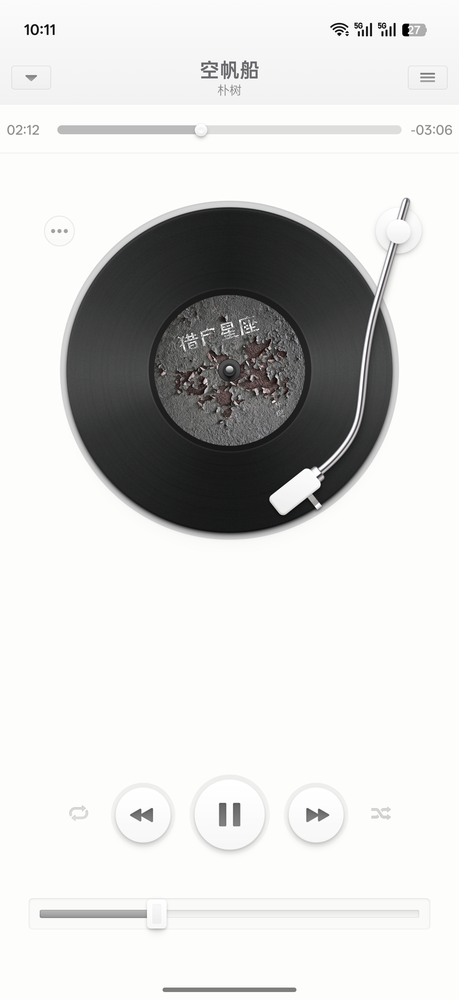
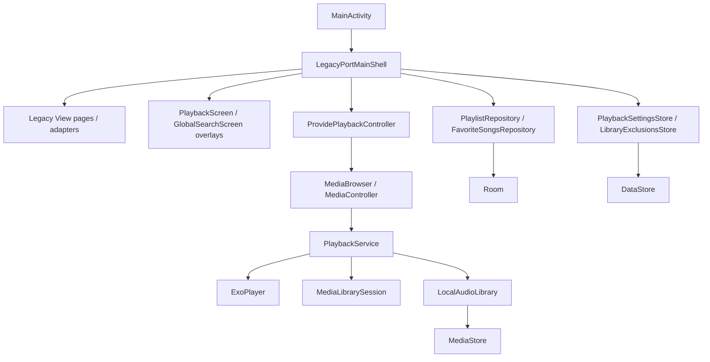

# 锤子音乐复刻 (Smartisan Music Revived)

> “这是为你们做的。”

使用现代 Android 技术栈，对 Smartisan OS 原版锤子音乐播放器进行 1:1 视觉与交互复刻，还原黑胶唱盘、唱针阻尼、光影层次、页面切换及操作反馈。

所有逆向分析和代码，来自我和 Codex (GPT-5.4-xhigh) 的持续对话。

## 真机截图

<p align="center">
  
</p>

## 开源 Prompt

```text
请协助我完成 Smartisan OS 原版锤子音乐（v6.8.0）的逆向整理与代码复刻。先完成 APK 逆向分析、资源盘点和规划文档整理，再使用 Kotlin、Jetpack Compose 与 Media3，在现代 Android 设备上 1:1 复刻原版的视觉、交互和播放体验。

要求：

1. 逆向整理
- 先收集原版 APK 的基础信息、反编译资源目录、页面入口、关键布局、关键位图、尺寸基准和阶段性结论。
- 将逆向结论沉淀到 reverse/音乐_6.8.0-逆向整理与复刻规划.md。
- 将反编译得到的 layout、drawable、values、AndroidManifest.xml 等资料整理到 `reverse/` 目录，供后续复刻使用。

2. 复刻基准
- 以 reverse/音乐_6.8.0-逆向整理与复刻规划.md 为阶段规划依据。
- 以 `reverse/` 目录中的规划文档、反编译资源和 Manifest 信息为原版结构、尺寸、资源命名和页面层级依据。
- 页面实现持续贴近原版视觉、动效、交互阻尼和资源层级，优先维护 1:1 像素级复刻目标。

3. 技术栈与工程边界
- 使用 Kotlin、Jetpack Compose、Navigation Compose、Media3、Room、DataStore。
- 当前仓库保持单模块 app，目录按 ui、data、playback、theme、navigation 等层组织，后续在规模增长后再平滑拆分模块。
- 包名使用 com.smartisanos.music。

4. 功能目标
- 使用 MediaStore 扫描本地音频。
- 使用 Media3 ExoPlayer、MediaController、MediaLibrarySession 建立本地播放链路。
- 提供五个一级页面，并保留全局小播放条与全屏播放页。
- 逐步实现专辑、艺术家、歌曲、播放列表、我喜欢的歌曲、文件夹、风格、更多、设置、歌词、Scratch、定时关闭播放、设置铃声等原版关键能力。
- 当前最重要的页面是全屏播放页，重点还原黑胶唱盘、唱针、歌词、控制面板、更多动作面板和切换动效。

5. 实现原则
- 默认使用简体中文沟通，代码注释和详细解释优先使用中文。
- 面对新版本库、新 API 或不确定实现方式，先查 Android 官方最新文档，再开始编码。
- 实现优先现代、直接、简洁、可维护，不主动写兼容性代码。
- 写代码前先理解现有工程和原版资料，避免凭记忆或过时经验直接实现。
- 如果原版资源和尺寸已经明确，优先按原版资源、原版命名和原版尺寸校准，不靠猜测复刻。

6. 开发工作流
- 开始开发前，先阅读 reverse/音乐_6.8.0-逆向整理与复刻规划.md。
- 按需查看 `reverse/` 目录中的规划文档、反编译资源和 Manifest 信息。
- 结合 developer.android.com、kotlinlang.org 和 Compose BOM 官方映射确认当前 API 和版本信息。
- 完成开发后运行对应的 Gradle 构建与测试命令。
- 保留代码和资源改动在工作区，等待我进行真机或模拟器测试。
- 只有在我明确说明测试通过并要求提交时，才执行 git add 与 git commit。
- 提交完成后同步更新 reverse/音乐_6.8.0-逆向整理与复刻规划.md，保持复刻规划与实际实现一致。
```

## 技术架构

原版应用作为 Smartisan OS 的系统预装组件，其界面基于早期的 Android View/XML 体系构建，业务代码则深度绑定于系统镜像。本项目以 Smartisan Music 8.1.0 移植版资源作为视觉基准，当前主界面采用 legacy View 壳承载原版结构与交互细节，播放页、搜索页和部分弹层保留 Compose 桥接，并基于 Media3 重建现代 Android 环境下的本地播放链路。

### 整体架构

项目采用单 Activity + legacy View 壳 + Compose 桥接弹层 + Media3 Service 的架构。UI 壳层负责复刻 8.1.0 的视觉与交互，播放、媒体库、收藏、歌单和设置继续由现代数据层驱动。



* **UI 层**：主界面使用 legacy View 壳复刻 8.1.0，播放页、搜索页和部分弹层保留 Compose 桥接。
* **播放层**：基于 Media3 架构实现 `PlaybackService`，负责后台音频播放控制、媒体会话（MediaSession）管理以及音频焦点的处理。
* **数据层**：使用 Room 数据库持久化用户的播放列表和收藏数据，使用 DataStore 存储应用设置与资料库过滤规则。

### 技术栈与依赖

本项目主要使用了以下技术与库（版本号以当前仓库配置为准）：

| 类别       | 技术方案                                                      |
| :--------- | ------------------------------------------------------------- |
| 构建工具   | Android Gradle Plugin `9.2.0`                               |
| 语言       | Kotlin `2.3.21`                                             |
| UI 桥接    | legacy View 壳 + Compose BOM `2026.04.01`                   |
| 现代音频   | Media3 `1.10.0`（`common` / `exoplayer` / `session`） |
| 持久化存储 | Room `2.8.4` + DataStore Preferences `1.2.1`              |
| 系统支持   | `minSdk 31` / `targetSdk 36` / `compileSdk 36`          |

### 工程目录结构

当前项目采用单模块结构，内部按照功能和层级进行了清晰的包名划分，为后续可能的模块化拆分做准备。

```text
.
├── app/
│   └── src/
│       ├── main/
│       │   ├── java/com/smartisanos/music/
│       │   │   ├── data/       # 数据层实现 (Room / DataStore)
│       │   │   ├── playback/   # Media3 播放控制与服务
│       │   │   └── ui/         # Compose UI、主题与页面逻辑
│       │   └── res/            # 位图与基础资源
├── reverse/                    # 原版逆向提取的资源与文档
└── ...
```

---

复刻它不只是怀旧。通过 Vibe Coding，让这张黑胶唱片在现代设备上继续转下去。
